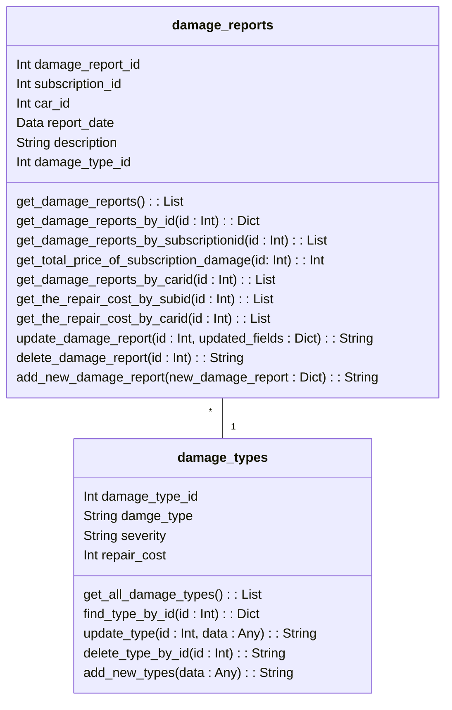

# Damage Microservice


## Table of Contents

- [Overview](#overview)
- [Core Functionalities](#core-functionalities)
  - [Damage Types API](#damage-types-api)
  - [Damage Reports API](#damage-reports-api)
  - [CRUD Operations](#crud-operations)
  - [JWT Authentication & Role-Based Access](#jwt-authentication--role-based-access)
- [Domain Model](#domain-model)
- [Entities and Their Roles](#entities-and-their-roles)
  - [Damage Reports](#damage-reports)
  - [Damage Types](#damage-types)
  - [Relationships in the damage microservice to other microservices](#relationships-in-the-damage-microservice-to-other-microservices)
- [Key Features](#key-features)
- [Technology Stack](#technology-stack)
- [Environment Variables](#environment-variables)
- [API Documentation](#api-documentation)
  - [Damage Types Endpoints](#damage-types-endpoints)
  - [Damage Reports Endpoints](#damage-reports-endpoints)
- [Swagger Documentation](#swagger-documentation)

## Overview

The **Damage Microservice** is a critical component of the **Bilabonnement management** system, designed to efficiently handle all damage report operations. Built using Flask and SQLite, it provides comprehensive APIs for managing damage types and damage reports, including retrieving, updating, and deleting records. The service implements a modular architecture with separate layers for API routes, data repositories, and database operations.

## Core Functionalities

This microservice provides the following core functionalities for managing **damage types** and **damage reports**:
### Damage Types API

Handles the categorization of damages by severity and repair cost. Provides endpoints to:

- Retrieve all damage types or a specific type by ID.
- Add new damage types to the system.
- Update or delete existing damage types.

### Damage Reports API

Tracks individual damage incidents, associating them with cars, subscriptions, and damage types. Key functionalities include:

- Retrieving damage reports by various filters (e.g., car ID, subscription ID).
- Adding new reports and updating existing ones.
- Calculating total repair costs for subscriptions.

### CRUD Operations

1. **Create (POST)**: Add new records (damage types or damage reports).
2. **Read (GET)**: Retrieve records (single or multiple damage types or damage reports).
3. **Update (PATCH)**: Modify existing records (damage types or damage reports) by ID.
4. **Delete (DELETE)**: Remove records (damage types or damage reports) by ID.

These operations ensure that users can manage damage types and damage reports via the API, allowing the system to maintain accurate and up-to-date data.

### JWT Authentication & Role-Based Access

The system utilizes **JSON Web Tokens (JWT)** for authenticating and authorizing users. Upon login, a user is issued a token that must be included in the `Authorization` header when making requests to the endpoints.

#### Available Roles:
- **admin**: Full access to all operations (Create, Read, Update, Delete).
- **finance**: Limited access to financial data, including total cost calculations.
- **maintenance**: Access to most operations, with some restrictions on adding and modifying data.

#### Example of Role Usage:
In `app.py`, you can see that routes are decorated with the `@auth.role_required` decorator, specifying the roles allowed to access each endpoint. For example:
```python
@app.route('/damage-types', methods=['GET'])
@auth.role_required('admin','finance','maintenance')
def get_damage_types_route():
    result = get_all_damage_types()
    return jsonify(result[1]), result[0]
```


## Domain Model



The **Damage Microservice** is responsible for handling damage-related data, including damage reports and damage types. The domain model defines how these two key entities interact and their roles in the system.


## Entities and Their Roles

### Damage Reports
- **Purpose**: Tracks instances of damage associated with cars and subscriptions.
- **Attributes**:
  - `damage_report_id`: A unique identifier for each damage report.
  - `subscription_id`: Links the damage to a specific subscription.
  - `car_id`: Links the damage to a specific car.
  - `report_date`: The date when the damage was reported.
  - `description`: A detailed description of the damage.
  - `damage_type_id`: References the specific type of damage.


- **Methods in the Microservice**:
  - `get_damage_reports()`: Retrieve all damage reports.
  - `get_damage_reports_by_id(id)`: Retrieve a specific damage report by its ID.
  - `get_damage_reports_by_subscriptioid(subscriptionid)`: Retrieve all damage reports for a specific subscription.
  - `get_damage_reports_by_carid(carid)`: Retrieve all damage reports for a specific car.
  - `get_the_repair_cost_by_subid(subscriptionid)`: Calculate the total cost of damage for a subscription.
  - `get_the_repair_cost_by_carid(carid)`: Calculate the total cost of damage for a car in the fleet.
  - `add_damage_report(damagereportid, update_fields)`: Add a new damage report.
  - `update_damage_report(carid, subscriptionid, reportdate, description, damagetypeid)`: Update an existing damage report.
  - `delete_damage_report(id)`: Delete a damage report.


### Damage Types
- **Purpose**: Represents categories of damage, along with their severity and repair cost.
- **Attributes**:
  - `damage_type_id`: A unique identifier for each damage type.
  - `damage_type`: The name of the damage type (e.g., scratch, dent, broken window).
  - `severity`: Describes the severity level of the damage (e.g., minor, major).
  - `repair_cost`: The cost to repair this type of damage.


- **Methods in the Microservice**:
  - `get_all_damage_types()`: Retrieve all damage types.
  - `get_find_type_by_id(id)`: Retrieve a specific damage type by its ID.
  - `add_types(data)`: Add a new damage type.
  - `update_type(id, data)`: Update an existing damage type.
  - `delete_type_by_id(id)`: Delete a damage type.

### Relationships in the damage microservice to other microservices

1. **Damage Reports and Cars**:
   - Each damage report is linked to one car.
   - Users can query reports by car ID to track damage history.

2. **Damage Reports and Subscriptions**:
   - Each damage report is tied to a subscription to track damages during a specific rental period.

3. **Damage Reports and Damage Types**:
   - A damage report references a damage type for categorization and cost estimation.
   - Ensures that all damages are consistently evaluated based on predefined classifications.


### Key Features

- **Damage Type Management**: Customizable management of various damage types with detailed definitions.
- **Real-time Damage Report Tracking**: Monitor and manage damage reports dynamically.
- **Comprehensive API Endpoints**: Retrieve, update, delete damage types, and handle damage reports with clear API structure and robust error handling.
- **Role-based Access Control**: Ensures secure access to API endpoints based on user roles (admin, finance, maintenance).
- **SQLite Database Integration**: Easy-to-use database with initialization scripts for setup.
- **Swagger Documentation**: Clear API documentation for seamless integration and usage.
- **Docker Containerization**: Simplifies deployment and management of the microservice.
- **Modular Architecture**: Enhanced maintainability with separate layers for API routes, data repositories, and database operations.


# Technology Stack

- **Programming Language:** Python  
- **Framework:** Flask  
- **Database:** SQLite3  
- **API Documentation:** Swagger/OpenAPI  
- **Deployment:** Azure Web App (using Docker container)  
- **CI/CD:** GitHub Actions  

## Enviroment Variables
- DB_PATH : /home/damage.db
- SECRET_KEY : This code should be contained in a .env file so it will take the key from that file

## API Documentation
### Base URL
- Local: [Localhost URL](https://localhost:5000)
- Production (Azure): [Azure URL](https://skade-microservice-cufpgqgfcufqa8er.northeurope-01.azurewebsites.net)

### Damage types

| Method | Endpoint                                 | Description                                | Request Body                                      | Response (200)                                          | Error Responses                                             |
|--------|------------------------------------------|--------------------------------------------|--------------------------------------------------|--------------------------------------------------------|------------------------------------------------------------|
| GET    | /damage-types                            | Get all damage types                       | N/A                                              | `[{"id": 1, "damage_type": "Scratch", "severity": "Low", "repair_cost": 150}]` | `404: {"error": "No damage types found"}`                  |
| GET    | /damage-types/{id}                       | Get damage type by ID                      | N/A                                              | `{"id": 1, "damage_type": "Scratch", "severity": "Low", "repair_cost": 150}` | `404: {"error": "Damage type not found"}`                  |
| PATCH  | /damage-types/{id}                       | Update damage type                         | `{"damage_type": "Dent", "severity": "Medium", "repair_cost": 200}` | `{"message": "Damage type updated successfully"}`       | `404: {"error": "Damage type not found"}`                  |
| POST   | /damage-types                            | Add new damage type                        | `{"damage_type": "Crack", "severity": "High", "repair_cost": 300}` | `{"message": "Damage type added successfully"}`          | `400: {"error": "Missing required fields"}`               |
| DELETE | /damage-types/{id}                       | Delete damage type by ID                   | N/A                                              | `{"message": "Damage type deleted successfully"}`        | `404: {"error": "Damage type not found"}`                  |

### Damage reports

| Method | Endpoint                                      | Description                               | Request Body                                      | Response (200)                                      | Error Responses                                      |
|--------|-----------------------------------------------|-------------------------------------------|--------------------------------------------------|----------------------------------------------------|-----------------------------------------------------|
| GET    | /damage-reports                               | Get all damage reports                    | N/A                                              | [{"damagereportid": 1, "carid": 101, "subscriptionid": 202, "reportdate": "2024-12-01", "description": "Minor scratch", "damagetypeid": 3}] | 204: {"message": "No items in the damage_reports"}  |
| GET    | /damage-reports/<int:id>                      | Get damage report by ID                   | N/A                                              | {"damagereportid": 1, "carid": 101, "subscriptionid": 202, "reportdate": "2024-12-01", "description": "Minor scratch", "damagetypeid": 3} | 404: {"message": "Damage report not found"}         |
| GET    | /damage-reports/cars/<int:id>                 | Get damage report by car ID               | N/A                                              | [{"damagereportid": 1, "carid": 101, "subscriptionid": 202, "reportdate": "2024-12-01", "description": "Minor scratch", "damagetypeid": 3}] | 404: {"message": "Damage report not found"}         |
| GET    | /damage-reports/subscriptions/<int:id>        | Get damage report by subscription ID      | N/A                                              | [{"damagereportid": 1, "carid": 101, "subscriptionid": 202, "reportdate": "2024-12-01", "description": "Minor scratch", "damagetypeid": 3}] | 404: {"message": "Damage report not found"}         |
| GET    | /damage-reports/subscriptions/<int:id>/total-damage | Get total repair cost for a subscription   | N/A                                              | {"subscriptionid": 202, "total_amount": 500.0}      | 404: {"message": "No damages found for the given subscription ID"} |
| PATCH  | /damage-reports/<int:id>                      | Update damage report by ID                | {"description": "New scratch", "reportdate": "2024-12-10"} | {"message": "Damage report updated successfully", "damage_report_id": 1} | 404: {"message": "Damage report not found"}         |
| POST   | /damage-reports                               | Add new damage report                     | {"carid": 101, "subscriptionid": 202, "reportdate": "2024-12-01", "description": "Minor scratch", "damagetypeid": 3} | {"message": "New damage report added successfully"}  | 400: {"error": "Missing required fields"}           |
| DELETE | /damage-reports/<int:id>                      | Delete damage report by ID                | N/A                                              | {"message": "Damage report deleted successfully and ID sequence reset"} | 404: {"message": "Damage report not found"}         |


## Swagger Documentation
Swagger UI is available at this link [Swagger Url](https://skade-microservice-cufpgqgfcufqa8er.northeurope-01.azurewebsites.net/docs)  
**To be able to use Swagger on endpoints connected to the damage microservice, it has to be done via the Swagger connected to the maintenance gateway.**
