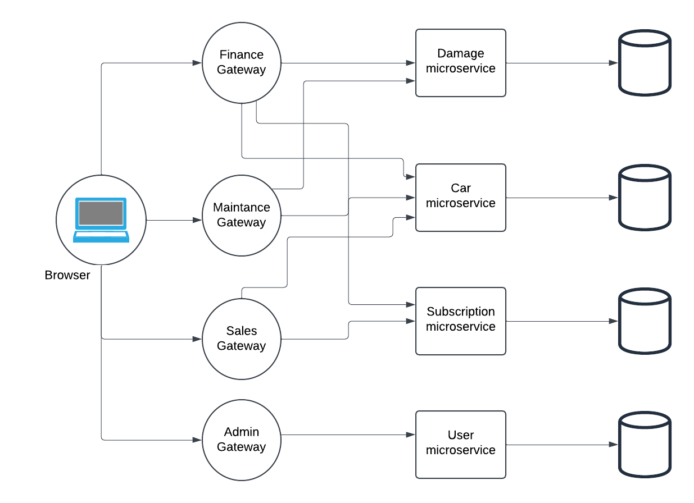

# Skade Microservice


## Overview

The **Skade Microservice** is a critical component of the **Bilabonnement management** system, designed to efficiently handle all damage report operations. Built using Flask and SQLite, it provides comprehensive APIs for managing damage types and damage reports, including retrieving, updating, and deleting records. The service implements a modular architecture with separate layers for API routes, data repositories, and database operations.

## Core Functionalities

This microservice provides the following core functionalities for managing **damage types** and **damage reports**:

### Key Features

- **Damage Type Management**: Customizable management of various damage types with detailed definitions.
- **Real-time Damage Report Tracking**: Monitor and manage damage reports dynamically.
- **Comprehensive API Endpoints**: Retrieve, update, delete damage types, and handle damage reports with clear API structure and robust error handling.
- **Role-based Access Control**: Ensures secure access to API endpoints based on user roles (admin, finance, maintenance).
- **SQLite Database Integration**: Easy-to-use database with initialization scripts for setup.
- **Swagger Documentation**: Clear API documentation for seamless integration and usage.
- **Docker Containerization**: Simplifies deployment and management of the microservice.
- **Modular Architecture**: Enhanced maintainability with separate layers for API routes, data repositories, and database operations.


---

### Damage Types API

Handles the categorization of damages by severity and repair cost. Provides endpoints to:

- Retrieve all damage types or a specific type by ID.
- Add new damage types to the system.
- Update or delete existing damage types.

### Damage Reports API

Tracks individual damage incidents, associating them with cars, subscriptions, and damage types. Key functionalities include:

- Retrieving damage reports by various filters (e.g., car ID, subscription ID).
- Adding new reports and updating existing ones.
- Calculating total repair costs for subscriptions.

---

### CRUD Operations

1. **Create (POST)**: Add new records (damage types or damage reports).
2. **Read (GET)**: Retrieve records (single or multiple damage types or damage reports).
3. **Update (PATCH)**: Modify existing records (damage types or damage reports) by ID.
4. **Delete (DELETE)**: Remove records (damage types or damage reports) by ID.

These operations ensure that users can manage damage types and damage reports via the API, allowing the system to maintain accurate and up-to-date data.

### JWT Authentication & Role-Based Access

The system utilizes **JSON Web Tokens (JWT)** for authenticating and authorizing users. Upon login, a user is issued a token that must be included in the `Authorization` header when making requests to the endpoints.

#### Available Roles:
- **admin**: Full access to all operations (Create, Read, Update, Delete).
- **finance**: Limited access to financial data, including total cost calculations.
- **maintenance**: Access to most operations, with some restrictions on adding and modifying data.

#### Example of Role Usage:
In `app.py`, you can see that routes are decorated with the `@auth.role_required` decorator, specifying the roles allowed to access each endpoint. For example:

```python
@app.route('/damage-types', methods=['GET'])
@auth.role_required('admin','finance','maintenance')
def get_damage_types_route():
    result = get_all_damage_types()
    return jsonify(result[1]), result[0]

```
## Project Structure
```
skade-microservice/
├── swagger/                              # Swagger documentation files
│   ├── add_damage_report.yaml            
│   ├── add_damage_type.yaml              
│   ├── config.py                         
│   ├── delete_damage_report.yaml         
│   ├── delete_damage_type.yaml           
│   ├── get_all_damage_reports.yaml       
│   ├── get_damage_type_by_id.yaml        
│   ├── get_damage_types.yaml             
│   ├── get_the_selected_damage_report_carid.yaml
│   ├── get_the_selected_damage_report_subscriptionid.yaml
│   ├── get_the_selected_damage_report.yaml
│   ├── get_total_cost_by_subscriptionid.yaml
│   ├── update_damage_report_by_id.yaml   
│   ├── update_damage_type.yaml           
├── app.py                                 # Main application entry point
├── auth.py                                # Authentication module
├── damage_reports.csv                     # CSV data for damage reports
├── damage_reports.py                      # Damage reports handling module
├── damage_type.py                         # Damage type handling module
├── damage_types.csv                       # CSV data for damage types
├── Dockerfile                             # Docker configuration file
├── README.md                              # Project documentation
└── requirements.txt                       # Python dependencies
```

---
## API Documentation

### Damage types

| Method | Endpoint                                 | Description                                | Request Body                                      | Response (200)                                          | Error Responses                                             |
|--------|------------------------------------------|--------------------------------------------|--------------------------------------------------|--------------------------------------------------------|------------------------------------------------------------|
| GET    | /damage-types                            | Get all damage types                       | N/A                                              | `[{"id": 1, "damage_type": "Scratch", "severity": "Low", "repair_cost": 150}]` | `404: {"error": "No damage types found"}`                  |
| GET    | /damage-types/{id}                       | Get damage type by ID                      | N/A                                              | `{"id": 1, "damage_type": "Scratch", "severity": "Low", "repair_cost": 150}` | `404: {"error": "Damage type not found"}`                  |
| PATCH  | /damage-types/{id}                       | Update damage type                         | `{"damage_type": "Dent", "severity": "Medium", "repair_cost": 200}` | `{"message": "Damage type updated successfully"}`       | `404: {"error": "Damage type not found"}`                  |
| POST   | /damage-types                            | Add new damage type                        | `{"damage_type": "Crack", "severity": "High", "repair_cost": 300}` | `{"message": "Damage type added successfully"}`          | `400: {"error": "Missing required fields"}`               |
| DELETE | /damage-types/{id}                       | Delete damage type by ID                   | N/A                                              | `{"message": "Damage type deleted successfully"}`        | `404: {"error": "Damage type not found"}`                  |

### Damage reports

| Method | Endpoint                                      | Description                               | Request Body                                      | Response (200)                                      | Error Responses                                      |
|--------|-----------------------------------------------|-------------------------------------------|--------------------------------------------------|----------------------------------------------------|-----------------------------------------------------|
| GET    | /damage-reports                               | Get all damage reports                    | N/A                                              | [{"damagereportid": 1, "carid": 101, "subscriptionid": 202, "reportdate": "2024-12-01", "description": "Minor scratch", "damagetypeid": 3}] | 204: {"message": "No items in the damage_reports"}  |
| GET    | /damage-reports/<int:id>                      | Get damage report by ID                   | N/A                                              | {"damagereportid": 1, "carid": 101, "subscriptionid": 202, "reportdate": "2024-12-01", "description": "Minor scratch", "damagetypeid": 3} | 404: {"message": "Damage report not found"}         |
| GET    | /damage-reports/cars/<int:id>                 | Get damage report by car ID               | N/A                                              | [{"damagereportid": 1, "carid": 101, "subscriptionid": 202, "reportdate": "2024-12-01", "description": "Minor scratch", "damagetypeid": 3}] | 404: {"message": "Damage report not found"}         |
| GET    | /damage-reports/subscriptions/<int:id>        | Get damage report by subscription ID      | N/A                                              | [{"damagereportid": 1, "carid": 101, "subscriptionid": 202, "reportdate": "2024-12-01", "description": "Minor scratch", "damagetypeid": 3}] | 404: {"message": "Damage report not found"}         |
| GET    | /damage-reports/subscriptions/<int:id>/total-damage | Get total repair cost for a subscription   | N/A                                              | {"subscriptionid": 202, "total_amount": 500.0}      | 404: {"message": "No damages found for the given subscription ID"} |
| PATCH  | /damage-reports/<int:id>                      | Update damage report by ID                | {"description": "New scratch", "reportdate": "2024-12-10"} | {"message": "Damage report updated successfully", "damage_report_id": 1} | 404: {"message": "Damage report not found"}         |
| POST   | /damage-reports                               | Add new damage report                     | {"carid": 101, "subscriptionid": 202, "reportdate": "2024-12-01", "description": "Minor scratch", "damagetypeid": 3} | {"message": "New damage report added successfully"}  | 400: {"error": "Missing required fields"}           |
| DELETE | /damage-reports/<int:id>                      | Delete damage report by ID                | N/A                                              | {"message": "Damage report deleted successfully and ID sequence reset"} | 404: {"message": "Damage report not found"}         |


## Postman Tests

This API provides several endpoints for managing damage types. Each damage type contains information about the type of damage, its severity, and associated repair costs.s

## Get All Damage Types
- **URL:** `/damage_types`
- **Method:** `GET`
- **Response:**
  ```json
  [
    {
      "id": 1,
      "damage_type": "Ridse",
      "severity": "Minor",
      "repair_cost": 500
    }
    // ... additional damage types
  ]
  ```
- **Success Response Code:** `200 OK`

## Get Damage Type by ID
- **URL:** `/damage_types/<id>`
- **Method:** `GET`
- **URL Parameters:** `id=[integer]` - ID of the damage type to retrieve
- **Response:**
  ```json
  {
    "id": 1,
    "damage_type": "Ridse",
    "severity": "Minor",
    "repair_cost": 500
  }
  ```
- **Success Response Code:** `200 OK`

## Update Damage Type
- **URL:** `/damage_types/<id>`
- **Method:** `PATCH`
- **URL Parameters:** `id=[integer]` - ID of the damage type to update
- **Request Body:**
  ```json
  {
    "id": 1,
    "damage_type": "Ridse",
    "severity": "Minor",
    "repair_cost": 500
  }
  ```
- **Success Response Code:** `200 OK`
- **Error Response Code:** `400 Bad Request` if no data is provided

## Add New Damage Type
- **URL:** `/damage_types`
- **Method:** `POST`
- **Request Body:**
  ```json
  {
    "damage_type": "Ridse",
    "severity": "Minor",
    "repair_cost": 500
  }
  ```
- **Success Response Code:** `200 OK`
- **Error Response Code:** `400 Bad Request` if no data is provided or if data is invalid

## Delete Damage Type
- **URL:** `/damage_types/<id>`
- **Method:** `DELETE`
- **URL Parameters:** `id=[integer]` - ID of the damage type to delete
- **Success Response Code:** `200 OK`

## Data Structure
Each damage type contains the following fields:
- `id`: Unique identifier for the damage type (integer)
- `damage_type`: Name/description of the damage type (string)
- `severity`: Severity level of the damage (Minor, Moderate, Severe)
- `repair_cost`: Estimated cost of repair in currency units (integer)


# Damage Reports API Documentation

## Base URL
`/damage-reports`

## Endpoints

### Get All Damage Reports
Get a list of all damage reports in the system.

**Request**
```http
GET /damage-reports
```

**Response**
- `200 OK`: Successfully retrieved damage reports
  ```json
  [
    {
      "damagereportid": integer,
      "carid": integer,
      "subscriptionid": integer,
      "reportdate": string,
      "description": string,
      "damagetypeid": integer
    }
  ]
  ```
- `204 No Content`: No damage reports found
- `500 Internal Server Error`: Server error

### Get Damage Report by ID
Retrieve a specific damage report by its ID.

**Request**
```http
GET /damage-reports/{id}
```

**Response**
- `200 OK`: Successfully retrieved damage report
- `404 Not Found`: Damage report not found
- `500 Internal Server Error`: Server error

### Get Damage Reports by Car ID
Retrieve all damage reports for a specific car.

**Request**
```http
GET /damage-reports/cars/{id}
```

**Response**
- `200 OK`: Successfully retrieved damage reports
- `404 Not Found`: No damage reports found for the car
- `500 Internal Server Error`: Server error

### Get Damage Reports by Subscription ID
Retrieve all damage reports for a specific subscription.

**Request**
```http
GET /damage-reports/subscriptions/{id}
```

**Response**
- `200 OK`: Successfully retrieved damage reports
- `404 Not Found`: No damage reports found for the subscription
- `500 Internal Server Error`: Server error

### Get Total Repair Cost by Subscription ID
Calculate the total repair cost for a specific subscription.

**Request**
```http
GET /damage-reports/subscriptions/{id}/total-damage
```

**Response**
- `200 OK`:
  ```json
  {
    "subscriptionid": integer,
    "total_amount": number
  }
  ```
- `404 Not Found`: No damages found for the subscription
- `500 Internal Server Error`: Server error

### Update Damage Report
Update an existing damage report by ID.

**Request**
```http
PATCH /damage-reports/{id}
```

**Request Body**
```json
{
  "field_name": "new_value"
}
```

**Response**
- `200 OK`: Successfully updated damage report
- `404 Not Found`: Damage report not found
- `500 Internal Server Error`: Server error

### Add New Damage Report
Create a new damage report.

**Request**
```http
POST /damage-reports
```

**Request Body**
```json
{
  "carid": integer,
  "subscriptionid": integer,
  "reportdate": string,
  "description": string,
  "damagetypeid": integer
}
```

**Response**
- `200 OK`: Successfully created damage report
- `400 Bad Request`: Missing required fields
- `409 Conflict`: Damage report already exists
- `500 Internal Server Error`: Server error

### Delete Damage Report
Delete a damage report by ID.

**Request**
```http
DELETE /damage-reports/{id}
```

**Response**
- `200 OK`: Successfully deleted damage report
- `404 Not Found`: Damage report not found
- `500 Internal Server Error`: Server error


